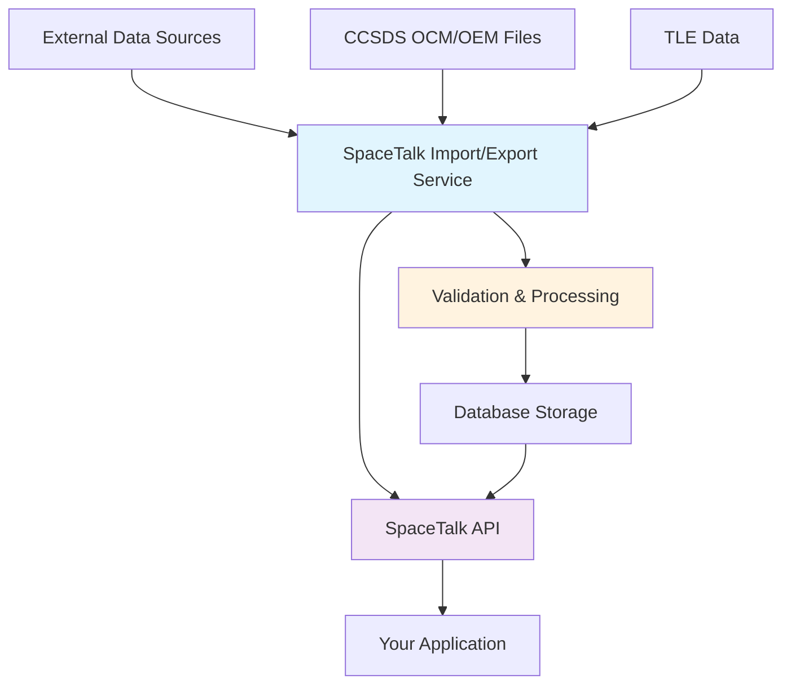

# Integration Guide

This guide explains how the SpaceTalk API integrates with the orbital data formats documented in this site.

## Data Flow Overview



## API Data Models ↔ Orbital Formats

### SST Events & Orbital Data

The SpaceTalk API's **SST Event** model directly maps to orbital data formats:

| API Field | CCSDS OCM Equivalent | TLE Equivalent | Description |
|-----------|---------------------|----------------|-------------|
| `orbit.orbitCategory` | ORBIT_CATEGORY | Derived from elements | LEO/MEO/GEO classification |
| `orbit.apogee` | Computed from state | Derived from elements | Apogee altitude (km) |
| `orbit.perigee` | Computed from state | Derived from elements | Perigee altitude (km) |
| `orbit.inclination` | TRAJ_TYPE elements | Inclination field | Orbital inclination (°) |
| `orbit.raan` | TRAJ_TYPE elements | RAAN field | Right ascension of ascending node (°) |
| `orbit.perigeeArgument` | TRAJ_TYPE elements | Argument of Perigee | Argument of perigee (°) |
| `orbit.epoch` | TIME tags | Epoch Year + Day | Reference epoch |
| `orbit.meanAnomalyAtEpoch` | TRAJ_TYPE elements | Mean Anomaly | Mean anomaly at epoch (°) |

### Space Objects & CCSDS Metadata

| API Field | CCSDS OCM Field | CCSDS OEM Field | Description |
|-----------|----------------|----------------|-------------|
| `name` | OBJECT_NAME | OBJECT_NAME | Space object name |
| `noradId` | OBJECT_DESIGNATOR | OBJECT_ID | NORAD catalog number |
| `internationalDesignator` | INTERNATIONAL_DESIGNATOR | OBJECT_ID | COSPAR designation |
| `objectType` | OBJECT_TYPE | N/A | Object classification |
| `country` | COUNTRY | N/A | Country of origin |

## Using the API with Format Specifications

### 1. Validating TLE Data via API

```javascript
// POST /ssts - Create SST with TLE-derived orbital elements
const sstData = {
  critical: false,
  sstEvents: [{
    sstType: "trajectory",
    orbit: {
      orbitCategory: "LEO",          // From TLE classification
      apogee: 408,                   // Computed from TLE elements
      perigee: 405,                  // Computed from TLE elements
      inclination: 51.6461,          // From TLE line 2
      raan: 339.7939,               // From TLE line 2
      perigeeArgument: 83.6287,     // From TLE line 2
      epoch: "2008-09-20T12:25:39Z", // From TLE epoch
      meanAnomalyAtEpoch: 276.5127  // From TLE line 2
    }
  }]
};
```

### 2. CCSDS OCM Integration

The API can consume CCSDS OCM data directly:

```javascript
// The import/export service processes OCM files
// and creates API-compatible data structures
const ocmData = {
  // OCM metadata becomes space object data
  spaceObject: {
    name: "OSPREY 5",              // From OCM OBJECT_NAME
    internationalDesignator: "2022-999A"  // From INTERNATIONAL_DESIGNATOR
  },
  // OCM trajectory blocks become SST events
  sstEvents: [{
    sstType: "trajectory",
    orbit: {
      // Derived from OCM TRAJ_TYPE=CARTPV data
      orbitCategory: "GEO",        // From OCM ORBIT_CATEGORY
      epoch: "2022-12-18T14:28:15Z" // From OCM trajectory time tags
    }
  }]
};
```

## Implementation Patterns

### Pattern 1: Format Validation + API Storage

```javascript
// 1. Validate format using specs from this documentation
const tleValidator = new TLEValidator({
  mode: 'lenient',  // As per TLE parsing docs
  checksumValidation: true
});

// 2. Parse and validate
const tleData = tleValidator.parse(tleString);

// 3. Convert to API format and store
const apiPayload = convertTLEToSST(tleData);
const response = await fetch('/ssts', {
  method: 'POST',
  body: JSON.stringify(apiPayload)
});
```

### Pattern 2: API Export to Standard Formats

```javascript
// 1. Get data from API
const sstData = await fetch('/ssts/12345').then(r => r.json());

// 2. Convert to CCSDS OCM format using format specs
const ocmData = convertSSTToOCM(sstData, {
  version: '3.0',  // CCSDS 505.0-B-2
  format: 'KVN'    // Key-Value Notation
});

// 3. Validate against OCM specification
const ocmValidator = new OCMValidator();
ocmValidator.validate(ocmData);
```

## Error Handling Integration

### API Validation Errors ↔ Format Violations

The API returns structured errors that map to format specification violations:

```json
{
  "error": "Validation failed",
  "code": "ORBITAL_VALIDATION_ERROR",
  "details": {
    "field": "orbit.eccentricity",
    "value": 1.5,
    "violation": "ECCENTRICITY_HYPERBOLIC",
    "specification": "TLE Format: eccentricity must be < 1.0",
    "reference": "/docs/orbital-data/tle/parsing-validation#field-validation"
  }
}
```

## Workflow Examples

### Workflow 1: TLE Processing Pipeline

1. **Input**: Raw TLE data from external source
2. **Validation**: Use [TLE Parsing Rules](/docs/orbital-data/tle/parsing-validation)
3. **Conversion**: Transform to API SST format
4. **API Call**: `POST /ssts` to store validated data
5. **Output**: Structured SST event with orbital elements

### Workflow 2: CCSDS Export Pipeline

1. **API Query**: `GET /ssts?format=detailed` for bulk data
2. **Transformation**: Convert to CCSDS OCM format
3. **Validation**: Check against [OCM Specification](/docs/orbital-data/ccsds/ocm)
4. **Export**: Generate compliant OCM files
5. **Distribution**: Share standardized orbital data

## Best Practices

### 1. **Use Format Specs for Client-Side Validation**
- Validate TLE/CCSDS data before API calls
- Reference the format documentation for validation rules
- Implement the parsing algorithms documented here

### 2. **API-First Data Management**
- Store canonical data via API
- Export to various formats as needed
- Maintain data lineage and provenance

### 3. **Error Correlation**
- Map API validation errors to format specification sections
- Provide users with links to relevant documentation
- Use structured error codes for programmatic handling

## Related Documentation

- [TLE Format Specification](/docs/orbital-data/tle/format-specification)
- [CCSDS OCM Structure](/docs/orbital-data/ccsds/ocm/structure)
- [API Error Codes](/docs/api/system/status/get)
- [Authentication Guide](/docs/api/authentication/auth/login/post)